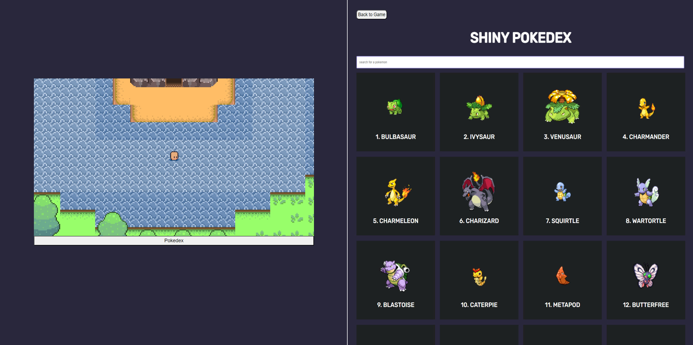

# Pokemon Game/Pokedex

## About

This application is a combination of a game demo and a pokedex database. The game demo is an area I made that is inspired from the game "Pokemon Diamond/Pearl". The pokedex pulls from the PokeAPI and it is very interactive. You can search by pokemon name or ID number and you can click on each pokemon for additional information.

## Features

- Use arrays, objects, sets or
  maps to store and retrieve
  information that is displayed
  in your app.
- Analyze data that is stored in
  arrays, objects, sets or maps
  and display information about
  it in your app.
- Analyze text and display
  useful information about it.
  (e.g. word/character count in
  an input field)
- Retrieve data from a
  third-party API and use it to
  display something within your
  app.
- Implement modern interactive
  UI features (e.g. table/data
  sorting, autocomplete,
  drag-and-drop,
  calendar-date-picker, etc).

## How to run and interact with this project

Clone [This Repository](https://github.com/KurtisEdwards220/pokemon-game)

Proceed to open `index.html` or `pokedex.html`

To interact with the game demo move around with the WASD keys in the game environment. If you would like to visit the pokedex, click the **Pokedex button** below the game. If you would like to return to the game environment, hit the **Back to Game button**.
